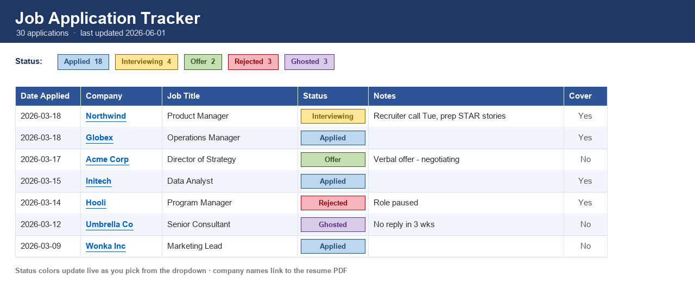

<div align="center">

# 📋 Resume Tracker Script

### Turn a folder of resumes into a beautiful, color-coded job-application tracker — automatically.

*No spreadsheets to build. No data entry. Name your resume files, double-click, done.*


[](https://github.com/OliviaKeiter/resume-tracker-script/releases/latest/download/Resume-Tracker.zip)



</div>

---

## ✨ What it does

You're applying to dozens of roles. Your resumes are already piling up in a folder. This little tool reads those files and builds a polished Excel tracker for you:

- 🗂️ **Reads each resume's name** to pull out the **company, job title, and date**
- 🎨 **Color-coded status** column with a dropdown — pick *Applied → Interviewing → Offer* and the cell **recolors instantly**
- 📝 A **Notes** column for recruiter names, interview dates, salary, follow-ups
- 🔗 **Clickable company names** that open the matching resume PDF
- 🧮 A **summary banner** with your totals and a color legend
- 🔁 **Re-run anytime** — it adds new jobs and **keeps everything you typed**
- 🚫 **No duplicate rows** — a job's PDF + Word version merge into one; cover letters are flagged, not duplicated
- 💾 **Automatic backups** every run, just in case

It works for *anyone* on a job hunt — not just developers. If you can rename a file and double-click, you can use it.

---

## 🚀 Quick start

> 🪟 Built for **Windows**. Takes about 5 minutes to set up the first time, then it's one double-click.

1. **[⬇ Download Resume-Tracker.zip](https://github.com/OliviaKeiter/resume-tracker-script/releases/latest/download/Resume-Tracker.zip)** and unzip it somewhere (e.g. a `Job Search` folder).
2. **Install Python** (if you don't have it) from [python.org/downloads](https://www.python.org/downloads/) — on the first installer screen, **tick “Add Python to PATH.”**
3. **Set your name** — open `update_job_report.py` in Notepad and change the one line near the top:
   ```python
   YOUR_NAME = "First Last"   # ← your full name, e.g. "Jane Doe"
   ```
4. **Add your resumes** to the same folder, named like the pattern below.
5. **Double-click `Update Job Report.bat`** → open the shiny new `job_applications.xlsx`. 🎉

📄 Full step-by-step guide: **[HOW TO USE - Read Me First.txt](HOW%20TO%20USE%20-%20Read%20Me%20First.txt)**

---

## 🏷️ How to name your resume files

Name each file like this (use underscores between the parts):

```
FirstName_LastName_Company_JobTitle.pdf
```

| File name | Reads as |
|---|---|
| `Jane_Doe_Google_ProductManager.pdf` | **Google** · Product Manager |
| `Jane_Doe_Spotify_DataAnalyst.docx` | **Spotify** · Data Analyst |
| `Jane_Doe_SandCherry_SrConsultant.pdf` | **Sand Cherry** · Senior Consultant |
| `Jane_Doe_Google_CoverLetter.pdf` | *(flagged as a cover letter — no separate row)* |

**A few tips**
- The first word after your name is the **company**; the rest is the **job title**.
- Keep multi-word companies together: `SandCherry`, not `Sand_Cherry`.
- Squished titles are fine — `AIProgramManager` becomes **AI Program Manager**.
- PDF + Word of the *same* job automatically merge into one row.
- Put **“Cover”** in cover-letter file names so they don't create duplicates.
- Anything guessed wrong? Just fix it in the spreadsheet — it's remembered next time.

> 👀 There's a ready-to-copy sample in **[`examples/`](examples/)** — `Jane_Doe_Google_ProductManager.pdf`.

---

## 📊 What you get

Two files appear next to the script:

- **`job_applications.xlsx`** — your main tracker (open this one). Status dropdowns, live colors, clickable resume links, a totals banner, filters, and a notes column.
- **`job_applications.csv`** — a plain-text copy of the same data.

Each row: **Date Applied · Company · Job Title · Status · Notes · Cover Letter? · Source Files**

---

## 🔁 Adding more jobs later

1. Drop the new resume(s) into the folder.
2. **Close** the spreadsheet (Excel locks the file while open).
3. Double-click **`Update Job Report.bat`** again.

New roles are added; your statuses, notes, and edits stay exactly as you left them. The previous version is tucked into a `report_backups/` folder automatically.

---

## 🛠️ Troubleshooting

| Problem | Fix |
|---|---|
| “Python is not installed” | Re-run the installer and tick **Add Python to PATH** |
| Company column shows your first name | Your `YOUR_NAME` line doesn't match the start of your file names |
| Company split in half (“Sand” not “Sand Cherry”) | Rename to `SandCherry`, or just type it in the sheet |
| Spreadsheet didn't update | It was open in Excel — close it and run again |

More detail in **[HOW TO USE - Read Me First.txt](HOW%20TO%20USE%20-%20Read%20Me%20First.txt)**.

---

## 🤝 Share it

Know someone in the trenches of a job search? Send them this repo. It's free, open-source (MIT), and made to make a stressful process a little more organized. 💙

<div align="center">

**Good luck out there — you've got this.** ☕

</div>
